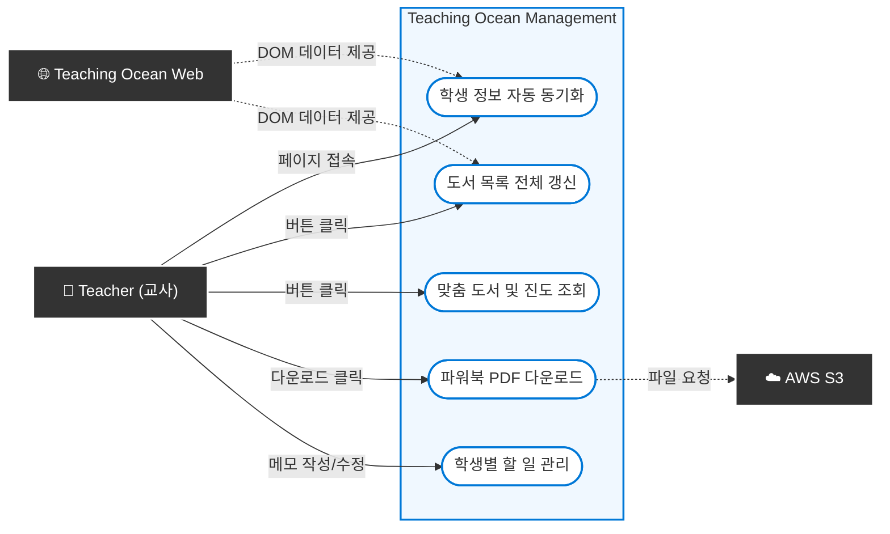

# 티칭오션(Teaching Ocean) 매니지먼트

## [ Revision history ]

| Revision date | Version # | Description | Author |
| :--- | :--- | :--- | :--- |
| 2026-03-27 | 1.0 | First Concept document |  |
| 2026-05-05 | 2.0 | 플랫폼 변경(Web ➔ Chrome Extension) 및 기능 변경 | |
| | | | |
| | | | |

# 1. Introduction

### 1.1 Summary
평소 '리딩오션' 학원 관리자들은 다수의 학생을 관리하고 맞춤형 독후 활동을 제공하기 위해 '티칭오션' 웹사이트를 이용합니다. 하지만 잦은 페이지 이동과 복잡한 탐색 과정으로 인해 실제 용천점과 같이 바쁘게 돌아가는 교육 현장에서는 업무 피로도가 높았습니다. 이러한 불편함을 해소하고, 관리자의 개인 노트북 환경에서 빠르고 직관적으로 학생 관리를 수행할 수 있도록 고안된 시스템이 바로 '티칭오션 매니지먼트(Teaching Ocean Management)' 크롬 확장 프로그램입니다.

### 1.2 Features of "Teaching Ocean Management"
티칭오션 매니지먼트는 개인 노트북에서 구동되는 확장 프로그램으로, 별도의 로그인 절차 없이 즉시 동작합니다. 교사는 브라우저 팝업창 하나에서 모든 핵심 업무를 처리할 수 있습니다. 현재 접속 중인 웹페이지의 데이터를 바탕으로 학생 정보를 자동 동기화하며, 학생의 현재 독서 레벨을 기준으로 시스템에 정의된 규칙(문학/비문학 레벨 매칭)에 따라 다음 도서를 빠르고 정확하게 산출해 냅니다. 또한, 필요한 파워북(PDF)을 즉시 다운로드하고 개별 학생의 메모를 관리하는 등 기존에 파편화되어 있던 기능들을 하나로 통합하여 업무 편의성을 극대화했다는 장점이 있습니다.

### 1.3 Goals
이번 Analysis 보고서에서는 티칭오션 매니지먼트를 사용하는 교사(관리자)와 시스템이 어떠한 구조로 상호작용하는지 다이어그램으로 그려보고, 각 기능들을 구체적으로 분석하여 명확하게 정의할 것입니다. 또한, 자동 동기화, 레벨 기반 도서 매칭, 스케줄 관리 등의 기능을 구현하기 위해 필요한 핵심 클래스들을 도출해 볼 것입니다.

# 2. Use case analysis

### 1.1 Use case diagram

### 2.2. Use Case Description

#### Use Case #1: 학생 정보 자동 동기화

**GENERAL CHARACTERISTICS**

| 항목 | 내용 |
| :--- | :--- |
| **Summary** | 교사가 티칭오션 웹사이트의 '학생관리' 페이지에 접속하면, 확장 프로그램이 백그라운드에서 화면의 학생 데이터를 읽어 데이터베이스(Supabase)를 최신 상태로 갱신하는 기능 |
| **Scope / Level** | Teaching Ocean Management / User level (Background process) |
| **Author** | 최재현 |
| **Last Update** | 2026-05-05 |
| **Status** | Analysis |
| **Primary Actor** | Teacher (교사) |
| **Preconditions** | 1. 브라우저에 확장 프로그램이 설치 및 활성화되어 있어야 한다. 2. 티칭오션 웹사이트에 로그인된 상태여야 한다. |
| **Trigger** | 교사가 티칭오션 웹사이트 내의 '학사관리 ➔ 학생관리' 페이지로 이동하여 화면 렌더링이 완료되었을 때 |
| **Success Post Condition** | 화면의 학생 데이터(이름, 소속, 레벨 등)가 성공적으로 스크래핑되어 DB에 최신 상태로 동기화된다. |
| **Failed Post Condition** | 네트워크 오류나 원본 웹사이트 구조 변경 등으로 인해 스크래핑 및 DB 동기화에 실패한다. |

 

**MAIN SUCCESS SCENARIO**

| Step | Action |
| :---: | :--- |
| **S** | 교사가 티칭오션 웹사이트의 '학생관리' 페이지에 접속하며 시작된다. |
| **1** | 확장 프로그램(Content Script)이 해당 페이지의 DOM(문서 구조) 로드 완료를 감지한다. |
| **2** | 화면에 표시된 학생 리스트 데이터(학생 이름, 현재 설정된 레벨 등)를 백그라운드에서 스크래핑하여 JSON 객체 배열 형태로 변환한다. |
| **3** | 스크래핑한 데이터를 확장 프로그램의 백그라운드 스크립트를 통해 서버(DB)로 전송한다. |
| **4** | 서버는 전송받은 데이터와 기존 DB 정보를 대조하여 신규 추가되거나 레벨이 변경된 학생 데이터만 필터링한 후, 일괄 갱신(Bulk Update/Insert)한다. |
| **5** | 백그라운드 동기화 작업이 조용히 완료되며 Use case가 끝이 난다. |

 

**EXTENSION SCENARIOS**

| Step | Branching Action |
| :---: | :--- |
| **1** | **1a. 웹페이지 로딩이 비정상적으로 지연되거나 무한 로딩이 걸린 경우** &nbsp;&nbsp;&nbsp;&nbsp;1a.1. 설정된 대기 시간(Timeout)을 초과하면 확장 프로그램은 동기화 시도를 안전하게 취소한다. |
| **2** | **2a. 티칭오션 원본 웹사이트의 UI(HTML 태그, 클래스명 등)가 패치되어 변경된 경우** &nbsp;&nbsp;&nbsp;&nbsp;2a.1. 확장 프로그램이 타겟 DOM 요소를 찾지 못해 스크래핑에 실패한다. &nbsp;&nbsp;&nbsp;&nbsp;2a.2. 에러 로그를 시스템에 남기고 동기화 프로세스를 중단한다. |
| **4** | **4a. 데이터베이스(Supabase) 접속 지연이나 네트워크 통신 에러가 발생한 경우** &nbsp;&nbsp;&nbsp;&nbsp;4a.1. 데이터 갱신을 취소하고 기존 상태로 롤백(Rollback) 처리한다. |

 

**RELATED INFORMATION**

| 항목 | 내용 |
| :--- | :--- |
| **Performance** | <= 5초 (페이지 로드 후 백그라운드 데이터 파싱 및 DB 저장 완료까지) |
| **Frequency** | Variable (학생관리 페이지에 접속할 때마다 실행) |
| **Concurrency** | None |

 

---

#### Use Case #2: 도서 목록 전체 갱신

**GENERAL CHARACTERISTICS**

| 항목 | 내용 |
| :--- | :--- |
| **Summary** | 교사가 팝업창에서 갱신 버튼을 클릭하면, 확장 프로그램이 웹사이트의 도서 목록 페이지를 순회(Pagination)하며 전체 도서 데이터를 DB에 동기화하는 기능 |
| **Scope / Level** | Teaching Ocean Management / User level |
| **Author** | 최재현 |
| **Last Update** | 2026-05-05 |
| **Status** | Analysis |
| **Primary Actor** | Teacher (교사) |
| **Preconditions** | 1. 티칭오션 웹사이트에 로그인된 상태여야 한다. |
| **Trigger** | 교사가 브라우저 우측 상단의 확장 프로그램 팝업을 열고 '책 종류 갱신' 버튼을 클릭했을 때 |
| **Success Post Condition** | 티칭오션 웹사이트의 모든 도서 데이터(도서명, 카테고리, 레벨 등)가 DB에 성공적으로 저장/갱신된다. |
| **Failed Post Condition** | 순회 중 오류가 발생하여 전체 도서 목록 동기화에 실패한다. |

 

**MAIN SUCCESS SCENARIO**

| Step | Action |
| :---: | :--- |
| **S** | 교사가 확장 프로그램 팝업의 '책 종류 갱신' 버튼을 클릭하며 시작된다. |
| **1** | 확장 프로그램은 백그라운드에서 티칭오션의 '도서 목록' 첫 페이지 URL을 숨김 상태(또는 백그라운드 탭)로 호출한다. |
| **2** | 페이지가 로드되면 현재 페이지의 도서 데이터(도서명, 장르, 난이도/레벨 등)를 스크래핑하여 배열에 임시 저장한다. |
| **3** | 다음 페이지 버튼(Pagination)을 클릭하거나 다음 페이지 URL을 호출하여 마지막 페이지에 도달할 때까지 **[Step 2]**를 반복한다. |
| **4** | 모든 페이지의 도서 스크래핑이 완료되면, 수집된 대량의 배열 데이터를 서버로 전송한다. |
| **5** | 서버는 JDBC Batch Update 등을 활용하여 수천 건의 도서 데이터를 한 번의 쿼리로 DB에 밀어 넣는다(Bulk Insert). |
| **6** | 팝업창에 "도서 목록 갱신이 완료되었습니다"라는 메시지를 띄우며 Use case가 끝이 난다. |

 

**EXTENSION SCENARIOS**

| Step | Branching Action |
| :---: | :--- |
| **2** | **2a. 특정 페이지 로드 중 네트워크 끊김 현상이 발생한 경우** &nbsp;&nbsp;&nbsp;&nbsp;2a.1. 재시도(Retry) 로직을 3회 수행한다. &nbsp;&nbsp;&nbsp;&nbsp;2a.2. 3회 모두 실패 시 작업을 중단하고 "네트워크 오류로 갱신이 중단되었습니다"라는 팝업을 띄운다. |
| **5** | **5a. 도서 데이터 전송 중 데이터베이스 용량 초과 또는 연결 오류 발생 시** &nbsp;&nbsp;&nbsp;&nbsp;5a.1. DB 갱신 트랜잭션을 롤백하고 사용자에게 실패 안내 메시지를 띄운다. |

 

**RELATED INFORMATION**

| 항목 | 내용 |
| :--- | :--- |
| **Performance** | <= 30초 (전체 페이지 순회 및 대량 데이터 Bulk Insert 처리 시간) |
| **Frequency** | Variable (신규 도서가 입고될 때 등 필요 시 수동 실행) |
| **Concurrency** | None |

#### Use Case #3: 맞춤 도서 및 진도 조회

**GENERAL CHARACTERISTICS**

| 항목 | 내용 |
| :--- | :--- |
| **Summary** | 교사가 팝업창에서 특정 학생의 진도율을 확인하고, 사전에 설정된 레벨 규칙(FirstLevel 기준)에 따라 문학/비문학 카테고리별 맞춤 도서(이전, 현재, 다음)를 시스템으로부터 매칭받아 조회하는 기능 |
| **Scope / Level** | Teaching Ocean Management / User level |
| **Author** | 최재현 |
| **Last Update** | 2026-05-05 |
| **Status** | Analysis |
| **Primary Actor** | Teacher (교사) |
| **Preconditions** | 1. 대상 학생의 데이터베이스 정보에 기준 레벨(`FirstLevel`)이 올바른 정규식 형태(`A_0`, `2_B` 등)로 설정되어 있어야 한다. 2. 도서(Book) 데이터베이스에 각 레벨별 도서 정보가 정상적으로 등록되어 있어야 한다. |
| **Trigger** | 교사가 확장 프로그램 팝업 내에서 특정 학생의 이름을 더블클릭하거나 '진도 및 도서 조회' 버튼을 클릭했을 때 |
| **Success Post Condition** | 학생의 독서 진도율(퍼센트)과 함께, 레벨 변환 규칙에 의해 정확히 계산된 문학/비문학 도서 6권(이전, 현재, 다음)이 화면에 시각적으로 렌더링된다. |
| **Failed Post Condition** | 학생의 기준 레벨 데이터 누락, 형식 오류 등의 이유로 도서 매칭 프로세스가 중단되고 에러 메시지가 출력된다. |

 

**MAIN SUCCESS SCENARIO**

| Step | Action |
| :---: | :--- |
| **S** | 교사가 특정 학생의 맞춤 도서 조회 버튼을 클릭하며 프로세스가 시작된다. |
| **1** | 확장 프로그램 프론트엔드는 서버로 해당 학생의 식별자(StudentId)를 포함하여 도서 추천 API를 호출한다. |
| **2** | 서버는 `SelectStudentService`를 통해 데이터베이스에서 대상 학생의 엔티티(Entity) 정보를 가져오고, 학생의 초기 기준 레벨(`FirstLevel`) 값을 파싱한다. |
| **3** | 서버는 내부 카테고리 변환 규칙에 따라 탐색의 기준이 될 `baseLevel`을 분리하여 계산한다. - **문학:** 학생의 `FirstLevel` 값을 그대로 적용한다. - **비문학:** 숫자 부분이 2 이하일 경우 무조건 `A_0` 레벨로 고정하고, 3 이상일 경우 `현재 숫자 - 1` 단계로 하향 조정하여 적용한다. |
| **4** | 계산된 `baseLevel`을 바탕으로 문학, 비문학 각각에 대해 `SelectReadBookService`와 `SelectBookService`를 호출하여 이전 수업 책 1권, 오늘 읽을 책 1권, 다음 수업 책 1권을 쿼리하여 가져온다. |
| **5** | 서버는 총 6권 분량의 도서 데이터 배열(`RecBookRes[][]`)과 누적 진도율 데이터를 JSON 형태로 묶어 확장 프로그램 측으로 반환한다. |
| **6** | 확장 프로그램은 전달받은 데이터를 팝업창 내의 탭(Tab) 또는 카드 UI에 맞게 정렬하여 교사에게 보여주며 Use case가 끝이 난다. |

 

**EXTENSION SCENARIOS**

| Step | Branching Action |
| :---: | :--- |
| **2** | **2a. 학생의 기준 레벨(`FirstLevel`) 값이 데이터베이스에 존재하지 않는 경우 (Null)** &nbsp;&nbsp;&nbsp;&nbsp;2a.1. 서버는 후속 로직 연산을 즉시 중단하고 null 객체를 반환한다. &nbsp;&nbsp;&nbsp;&nbsp;2a.2. 확장 프로그램은 팝업창 상단에 "해당 학생의 초기 레벨이 설정되지 않아 도서를 매칭할 수 없습니다."라는 경고성 알림창을 띄운다. |
| **3** | **3a. 학생의 레벨 데이터가 시스템이 지정한 정규식 패턴(`LevelRegexPattern`)과 일치하지 않는 경우** &nbsp;&nbsp;&nbsp;&nbsp;3a.1. 서버 측에서 `INVALID_FIRST_LEVEL` 커스텀 예외(Exception)를 강제로 발생시킨다. &nbsp;&nbsp;&nbsp;&nbsp;3a.2. 에러 핸들러가 이를 감지하여 프론트엔드 측에 잘못된 레벨 형식임을 안내하는 에러 코드를 전송한다. |
| **4** | **4a. 데이터베이스에 계산된 레벨에 해당하는 도서 재고가 부족한 경우 (예: 다음에 읽을 책이 DB에 미등록된 상태)** &nbsp;&nbsp;&nbsp;&nbsp;4a.1. 시스템 내의 인덱스 예외 방지 로직(`getSafe`)이 작동하여, 존재하지 않는 인덱스 접근 시 Exception 대신 null을 반환하도록 유도한다. &nbsp;&nbsp;&nbsp;&nbsp;4a.2. 프론트엔드는 도서가 존재하는 칸만 렌더링하고, 데이터가 없는 칸은 비워두거나 "도서 준비 중"이라는 대체 텍스트를 출력하여 시스템 크래시를 방지한다. |

 

**RELATED INFORMATION**

| 항목 | 내용 |
| :--- | :--- |
| **Performance** | <= 3초 (학생 레벨 파싱, 진도율 연산 및 총 6건의 도서 조회 트랜잭션 완료까지) |
| **Frequency** | High (학생 관리 및 다음 주차 진도 세팅 시 빈번하게 발생) |
| **Concurrency** | None |

 

---

#### Use Case #4: 파워북 PDF 다운로드

**GENERAL CHARACTERISTICS**

| 항목 | 내용 |
| :--- | :--- |
| **Summary** | 교사가 맞춤 도서 조회 결과 화면에서 특정 도서의 독후 활동지(파워북) PDF 파일을 원격 저장소(AWS S3)로부터 로컬 환경(노트북)으로 즉시 다운로드하는 기능 |
| **Scope / Level** | Teaching Ocean Management / User level |
| **Author** | 최재현 |
| **Last Update** | 2026-05-05 |
| **Status** | Analysis |
| **Primary Actor** | Teacher (교사) |
| **Preconditions** | 1. 해당 도서 정보에 연결된 파워북 파일의 S3 객체 키(Object Key) 또는 URL 경로가 데이터베이스(`FileRepository`)에 등록되어 있어야 한다. 2. 서버가 AWS S3 버킷에 접근할 수 있는 유효한 IAM 권한을 지니고 있어야 한다. |
| **Trigger** | 팝업창 내에서 특정 도서 항목 옆에 위치한 '파워북 다운로드' 아이콘을 클릭했을 때 |
| **Success Post Condition** | 해당 도서의 고화질 파워북 PDF 파일이 교사의 로컬 PC 다운로드 폴더에 성공적으로 저장된다. |
| **Failed Post Condition** | 파일 유실, S3 권한 오류, DB 불일치 등의 이유로 다운로드가 거부되거나 빈 파일이 내려받아진다. |

 

**MAIN SUCCESS SCENARIO**

| Step | Action |
| :---: | :--- |
| **S** | 교사가 필요한 도서 옆의 다운로드 버튼을 클릭하며 프로세스가 시작된다. |
| **1** | 확장 프로그램은 서버의 파일 처리 API(`/api/files/download`)로 해당 도서의 고유 ID를 전송하여 파일 요청을 시도한다. |
| **2** | 서버는 전송받은 도서 ID를 바탕으로 `FileRepository`를 조회하여 AWS S3 저장소에 보관된 해당 파일의 정확한 경로(Key)와 파일명 메타데이터를 확보한다. |
| **3** | 서버 내의 AWS S3 클라이언트 객체가 해당 경로의 객체(Object)에 대한 다운로드 스트림을 열거나, 일정 시간 동안만 유효한 Pre-signed URL을 생성하여 프론트엔드로 반환한다. |
| **4** | 확장 프로그램은 전달받은 바이너리 스트림 데이터를 Blob 객체로 변환하거나 URL을 실행하여 크롬 브라우저의 기본 다운로드 API(`chrome.downloads`)를 호출한다. |
| **5** | 교사의 로컬 노트북(기본 다운로드 경로)에 파워북 PDF 파일이 지정된 원래의 파일명으로 안전하게 저장되며 Use case가 끝이 난다. |

 

**EXTENSION SCENARIOS**

| Step | Branching Action |
| :---: | :--- |
| **2** | **2a. 데이터베이스에 해당 도서와 매핑된 파워북 파일 데이터가 존재하지 않는 경우** &nbsp;&nbsp;&nbsp;&nbsp;2a.1. 서버는 `FILE_NOT_FOUND` 예외를 발생시키고 실패 응답을 보낸다. &nbsp;&nbsp;&nbsp;&nbsp;2a.2. 팝업창에 "해당 도서는 등록된 파워북 자료가 없습니다."라는 안내 메시지를 출력한다. |
| **3** | **3a. AWS S3 버킷 정책 오류 또는 접근 권한(Access Denied) 문제로 객체 스트림을 열지 못한 경우** &nbsp;&nbsp;&nbsp;&nbsp;3a.1. AWS SDK에서 에러를 뿜으며 요청을 거부한다. &nbsp;&nbsp;&nbsp;&nbsp;3a.2. 서버는 시스템 에러 로그를 남기고, 교사에게는 "파일 서버 통신에 실패했습니다. 관리자에게 문의하세요."라는 문구를 띄운다. |
| **4** | **4a. 로컬 브라우저의 보안 설정이나 용량 부족으로 인해 다운로드가 차단된 경우** &nbsp;&nbsp;&nbsp;&nbsp;4a.1. 다운로드 작업이 강제로 취소되며 브라우저 자체 경고 알림이 발생한다. |

 

**RELATED INFORMATION**

| 항목 | 내용 |
| :--- | :--- |
| **Performance** | <= 5초 (S3 객체 URL 반환 및 로컬 브라우저의 다운로드 트리거 완료까지) |
| **Frequency** | High (학생의 독서 완료 후 활동지 인쇄 목적) |
| **Concurrency** | None |

 

---

#### Use Case #5: 학생별 할 일 관리

**GENERAL CHARACTERISTICS**

| 항목 | 내용 |
| :--- | :--- |
| **Summary** | 교사가 학생 개개인의 상담 일정, 학습 계획 등 마감 기한이 정해진 할 일(To-Do / Memo) 데이터를 확장 프로그램 팝업창 내에서 조회, 등록, 수정, 삭제(CRUD)하는 기능 |
| **Scope / Level** | Teaching Ocean Management / User level |
| **Author** | 최재현 |
| **Last Update** | 2026-05-05 |
| **Status** | Analysis |
| **Primary Actor** | Teacher (교사) |
| **Preconditions** | 학생 데이터베이스에 대상 학생의 고유 식별자가 존재해야 한다. |
| **Trigger** | 팝업창에서 특정 학생의 '할 일(메모) 관리' 탭으로 진입하여 생성/수정/삭제 액션을 취했을 때 |
| **Success Post Condition** | 작성되거나 수정된 메모 내용과 기한 일자가 시스템(DB)에 안전하게 반영되며, 팝업창 UI 목록이 최신화된다. |
| **Failed Post Condition** | 유효하지 않은 날짜 형식 입력, 네트워크 오류 등으로 인해 데이터베이스 저장이 실패하고 작업 이전 상태로 롤백된다. |

 

**MAIN SUCCESS SCENARIO**

| Step | Action |
| :---: | :--- |
| **S** | 교사가 학생별 관리 창에서 신규 메모 작성을 위해 '추가' 버튼을 클릭하며 시작된다. |
| **1** | 팝업창에 내용을 입력하는 텍스트 영역과 마감 기한(Due Date)을 선택할 수 있는 캘린더 UI가 활성화된다. |
| **2** | 교사가 상담 예정 내용이나 지도 계획을 상세히 텍스트로 입력하고, 특정 마감 날짜를 지정한 뒤 '저장'을 누른다. |
| **3** | 프론트엔드는 학생 ID, 메모 내용 텍스트, 날짜 데이터 등을 묶어 서버의 Task 관련 API(`/api/tasks`)로 POST 요청을 보낸다. |
| **4** | 서버는 `TaskRepository`를 통해 해당 데이터를 영속성 컨텍스트에 Insert하고, 성공 상태 코드를 반환한다. |
| **5** | 확장 프로그램은 저장 성공 응답을 받은 즉시 메모 리스트를 새로고침하여 화면을 리렌더링한다. |
| **6** | 이때 렌더링 과정에서, 오늘 날짜를 기준으로 마감 기한이 이미 지났거나 하루 앞으로 임박한 메모 항목의 경우 글자색을 붉은색으로 처리하거나 경고 아이콘을 붙여 시각적으로 강하게 강조하며 Use case가 끝이 난다. |

 

**EXTENSION SCENARIOS**

| Step | Branching Action |
| :---: | :--- |
| **2** | **2a. 필수 입력 값인 내용(Content)을 전혀 입력하지 않고 빈칸으로 저장을 시도한 경우** &nbsp;&nbsp;&nbsp;&nbsp;2a.1. 프론트엔드 단에서 유효성 검사(Validation)에 실패하여 서버 전송을 아예 차단한다. &nbsp;&nbsp;&nbsp;&nbsp;2a.2. 텍스트 박스 테두리를 붉게 칠하고 "메모 내용을 입력해 주세요"라는 툴팁을 띄운다. **2b. 과거의 날짜를 마감 기한으로 설정하여 저장을 시도한 경우** &nbsp;&nbsp;&nbsp;&nbsp;2b.1. "과거 날짜로 기한을 설정할 수 없습니다."라는 경고창을 띄우고 입력을 취소시킨다. |
| **4** | **4a. 입력된 텍스트 내용의 길이가 데이터베이스 컬럼(Column)의 최대 허용 길이를 초과한 경우** &nbsp;&nbsp;&nbsp;&nbsp;4a.1. 데이터베이스에서 DataTruncation 에러를 발생시키며 저장을 거부(Rollback)한다. &nbsp;&nbsp;&nbsp;&nbsp;4a.2. 교사에게 "글자 수를 초과했습니다. 내용을 줄여주세요."라는 안내 메시지를 띄운다. |
| **6** | **(Alternative) 기존에 작성된 메모를 클릭하여 수정하거나 삭제(Delete) 버튼을 누른 경우** &nbsp;&nbsp;&nbsp;&nbsp;6a.1. 해당 Action에 맞춰 PUT 또는 DELETE API를 서버로 전송한다. &nbsp;&nbsp;&nbsp;&nbsp;6a.2. DB 반영 완료 후 동일하게 리스트를 새로고침하여 UI를 동기화한다. |

 

**RELATED INFORMATION**

| 항목 | 내용 |
| :--- | :--- |
| **Performance** | <= 2초 (저장/수정/삭제 요청 후 리스트 갱신 완료까지) |
| **Frequency** | High (매일 학생별 특이사항 기록 시 사용) |
| **Concurrency** | None |

# 3. Domain analysis

이 장에서는 티칭오션 매니지먼트 시스템의 핵심 기능을 구현하기 위해 필요한 비즈니스 도메인 객체들을 식별하고, 각 객체의 역할과 속성을 정의합니다.

**1) Student (학생)**
티칭오션 시스템에서 관리되는 학생 객체입니다. 원본 웹사이트에서 동기화된 원생 정보를 담고 있으며, 학생의 고유 식별자(studentId)와 이름(name) 속성을 가집니다. 특히, AI가 아닌 시스템 내부 규칙에 따라 맞춤 도서를 매칭하기 위해 기준이 되는 초기 레벨(firstLevel)과 현재 달성 레벨(currentLevel) 속성을 필수로 포함합니다. 하나의 학생 객체는 여러 개의 독서 이력(ReadBook)과 할 일(StudentTask)을 가질 수 있습니다.

**2) Book (도서)**
티칭오션의 전체 도서 목록을 나타내는 객체입니다. 확장 프로그램을 통해 수천 건의 데이터가 일괄 동기화되며, 도서를 식별하는 기본 키(bookId)와 제목(title)을 속성으로 가집니다. 또한, 학생의 레벨과 매칭하기 위해 도서의 장르를 구분하는 카테고리(category: 문학/비문학)와 해당 도서의 난이도를 나타내는 적정 읽기 레벨(targetLevel) 속성을 가지고 있습니다.

**3) ReadBook (독서 이력)**
학생(Student)과 도서(Book) 사이의 진행 상태를 연결해 주는 객체입니다. 특정 학생이 어떤 책을 언제 읽었는지, 그리고 다음 진도가 무엇인지 추적하기 위해 학생 식별자와 도서 식별자를 외래 키로 포함합니다. 이 객체는 해당 도서의 현재 분류 상태(readStatus: 이전 수업, 오늘 읽을 책, 다음 수업 예정)와 해당 장르에 대한 누적 진도율(progressRate)을 속성으로 가집니다.

**4) PowerbookFile (파워북 파일)**
특정 도서에 종속되어 제공되는 부가 학습 자료(독후 활동지 PDF)에 대한 메타데이터를 관리하는 객체입니다. 실제 바이너리 파일은 데이터베이스가 아닌 AWS S3 저장소에 보관되므로, 이 객체는 어떤 도서의 파일인지 식별하는 도서 식별자와 로컬 다운로드 시 사용할 파일명(fileName), 그리고 AWS S3 서버에 저장된 실제 파일의 고유 경로(s3ObjectKey)를 속성으로 가집니다.

**5) StudentTask (학생별 할 일)**
교사가 특정 학생에 대해 개별적으로 작성하는 스케줄 및 상담 메모 객체입니다. 이 객체는 어떤 학생의 메모인지 구분하기 위한 학생 식별자를 포함하며, 교사가 작성한 텍스트 내용(content), 설정된 마감 기한(dueDate), 그리고 해당 메모의 완료 여부(isCompleted)를 속성으로 가집니다. 시스템은 이 마감 기한 속성을 참조하여 날짜가 임박한 메모를 UI에서 시각적으로 강조합니다.

# 4. User Interface prototype

이 장에서는 티칭오션 매니지먼트 크롬 확장 프로그램의 사용자 인터페이스(UI) 화면 구성을 정의합니다. 시스템은 좁은 브라우저 팝업창 환경에서 스크롤과 페이지 이동을 최소화하기 위해 직관적인 탭(Tab) 구조로 설계되었습니다.

**1) 메인 화면 (학생 검색 및 도서 갱신)**
교사가 브라우저 상단의 확장 프로그램 아이콘을 클릭했을 때 가장 먼저 나타나는 메인 팝업 화면입니다. 상단 헤더에는 '도서 목록 전체 갱신' 버튼이 배치되어 있어, 교사가 원할 때 언제든 클릭하여 원본 웹사이트의 최신 도서 데이터를 DB에 동기화할 수 있습니다. 화면 중앙에는 백그라운드 스크래핑을 통해 동기화된 원생들의 목록이 리스트 형태로 나열됩니다. 상단에 위치한 검색창을 통해 특정 학생의 이름을 빠르게 찾을 수 있으며, 학생의 이름을 더블클릭하면 해당 학생의 상세 관리 화면으로 즉시 진입합니다.

**2) 학생 상세 화면 - 맞춤 도서 및 진도 탭**
특정 학생을 선택했을 때 나타나는 첫 번째 탭 화면입니다. 화면 최상단에는 해당 학생의 이름과 현재 달성 레벨, 그리고 문학과 비문학의 누적 진도율이 퍼센트(%) 게이지 바 형태로 시각화되어 표시됩니다. 중앙 영역은 '문학'과 '비문학' 두 개의 열(Column)로 나뉘며, 각 열에는 시스템의 레벨 매칭 규칙에 따라 도출된 총 3권의 책(이전 수업 도서, 오늘 읽을 도서, 다음 수업 도서)이 카드 형태로 나열됩니다. 각각의 도서 카드 우측 하단에는 직관적인 '다운로드 아이콘'이 배치되어 있으며, 이 버튼을 클릭하면 해당 도서의 파워북 PDF 파일이 교사의 로컬 노트북으로 즉시 다운로드됩니다.

**3) 학생 상세 화면 - 할 일(메모) 관리 탭**
학생 상세 화면에서 전환할 수 있는 두 번째 탭입니다. 상단에는 교사가 상담 내용이나 학습 계획을 텍스트로 입력할 수 있는 텍스트 영역(Textarea)과 마감 기한을 선택할 수 있는 캘린더 드롭다운, 그리고 '등록' 버튼이 위치합니다. 그 아래 영역에는 기존에 작성된 개별 할 일 목록이 최신순으로 렌더링됩니다. 각 항목에는 내용과 기한 날짜가 표시되며, 만약 오늘 날짜를 기준으로 기한이 임박했거나 초과된 항목은 글자색이 붉은색으로 칠해지거나 경고 아이콘이 추가되어 교사의 주의를 환기시킵니다. 각 항목의 끝에는 수정 및 삭제 아이콘이 있어 팝업 내에서 즉각적인 관리가 가능합니다.

**4) 시스템 알림 요소 (Toast Notification)**
기존 웹사이트의 무거운 경고창(Alert)을 대체하기 위한 간이 알림 UI입니다. 학생 정보 동기화 완료, 전체 도서 목록 스캔 성공, 파워북 파일 없음 등의 상태 및 에러 메시지는 팝업창 하단에서 잠시 떠올랐다 사라지는 토스트 알림(Toast Notification) 형태로 제공됩니다. 특히 네트워크 오류나 데이터베이스 접속 실패 등 중요한 에러 상황일 경우, 알림창의 배경을 붉은색으로 처리하여 교사가 문제 상황을 즉시 인지할 수 있도록 돕습니다.

# 5. Glossary

이 장에서는 본 요구사항 명세서 및 프로젝트 전반에 걸쳐 사용되는 주요 비즈니스 용어와 기술 용어를 정의하여 이해관계자 간의 의사소통 혼선을 방지합니다.

| 용어 (Term) | 설명 (Description) |
| :--- | :--- |
| **티칭오션 (Teaching Ocean)** | 리딩오션(Reading Ocean) 본사에서 학원 관리자 및 교사를 위해 제공하는 기존의 학생/도서 관리 웹 플랫폼 원본. |
| **티칭오션 매니지먼트** | 본 프로젝트에서 새롭게 개발하는 '크롬 확장 프로그램'의 공식 명칭. 기존 웹사이트의 핵심 기능을 팝업창 하나로 통합한 시스템. |
| **파워북 (Powerbook)** | 특정 도서를 읽은 후 학생들이 수행해야 하는 독후 활동지 및 워크북 형태의 고화질 PDF 학습 자료. |
| **크롬 확장 프로그램 (Chrome Extension)** | 구글 크롬 브라우저에 부가적인 기능을 추가하는 소프트웨어. 본 시스템의 프론트엔드/클라이언트 실행 환경이 됨. |
| **DOM 스크래핑 (Scraping)** | 웹 페이지의 문서 구조(HTML/DOM)를 백그라운드에서 분석하여 학생 리스트나 도서 정보 등 필요한 데이터를 자동으로 추출해 내는 기술. |
| **FirstLevel (초기/기준 레벨)** | 학생이 처음 학원에 등록할 때 부여받는 독서 레벨(예: `A_0`, `2_B`). 시스템이 문학/비문학 다음 진도 도서를 계산하고 매칭하는 핵심 기준값. |
| **Bulk Insert / Update** | 수천 건의 도서나 학생 데이터를 데이터베이스에 한 줄씩 넣지 않고, 한 번의 쿼리로 대량 삽입 및 갱신하여 서버 성능을 최적화하는 DB 연산 기법. |
| **AWS S3 (Amazon S3)** | 대용량 파일(PDF 등)을 안전하게 저장하고 빠르고 저렴하게 배포하기 위해 사용하는 아마존의 클라우드 객체 스토리지 서비스. |
| **Supabase (수파베이스)** | 본 프로젝트에서 메인 데이터베이스(PostgreSQL) 및 백엔드 일부 기능으로 활용되는 오픈소스 BaaS(Backend as a Service) 플랫폼. |

 

# 6. References

1. **Google Chrome Developers**, "Chrome Extension Architecture & API Reference". (크롬 확장 프로그램 매니페스트 V3 설계 및 백그라운드 스크립트 구현 참고)
   - *URL: https://developer.chrome.com/docs/extensions*
2. **Amazon Web Services (AWS)**, "Amazon Simple Storage Service (S3) Documentation". (파워북 PDF 파일 저장소 구축 및 Pre-signed URL 다운로드 연동 참고)
   - *URL: https://docs.aws.amazon.com/s3/*
