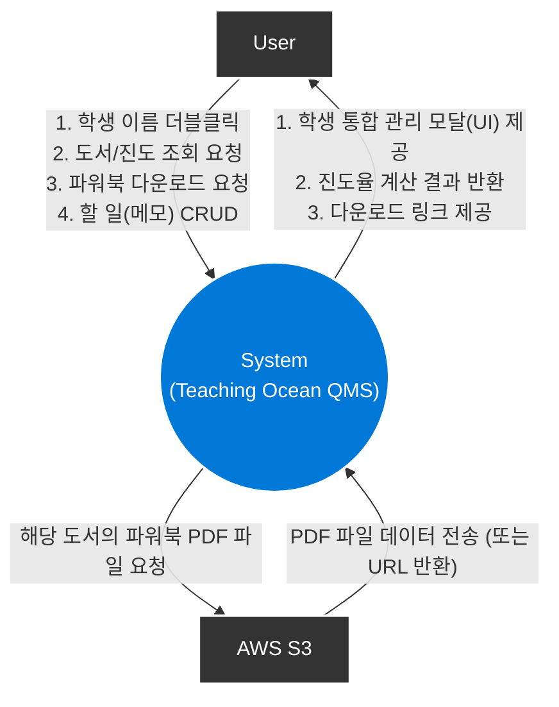

# 티칭오션(Teaching Ocean) 퀵 매니지먼트

## [ Revision history ]

| Revision date | Version # | Description | Author |
| :--- | :--- | :--- | :--- |
| 2026-03-27 | 1.0 | First Concept document |  |
| | | | |
| | | | |
| | | | |

# 1. Business purpose

### 1.1 Project background
평소 '리딩오션' 학원 관리자들은 '티칭오션'이라는 홈페이지를 사용하여 다수의 학생을 동시에 관리하며 맞춤형 교육을 제공해야 하는 과제를 안고 있다. 체계적인 독서를 가르치는 이 '리딩오션' 기업의 '티칭오션' 홈페이지는 학생 개개인의 정보, 독서 이력 및 수준 파악, 그에 따른 맞춤형 독후 활동지(파워북) 제공을 하는 기능들이 있다.

기존의 '티칭오션' 웹사이트는 이러한 기능들을 훌륭하게 제공하고 있으나, 실제 바쁘게 돌아가는 교육 현장의 '연속적인 업무 흐름'을 처리하는 데에는 UI/UX 적인 한계가 존재했다. 예를 들어, 교사가 A라는 학생이 현재 어떤 수준이며, 어떤 책들을 읽었는지 확인하고, 그에 맞는 파워북을 다운로드하여 인쇄하는 기능을 사용하기 위해서는 **'학사관리 ➔ 학생 상세 페이지 이동 ➔ 레벨 확인 ➔ 독서관리 ➔ 도서 목록 ➔ 독서기록장(파워북) 존재 여부 확인 ➔ 없으면 따로 저장한 폴더 ➔ 이름 검색 후 파일 인쇄'로** 이어지는 깊은 페이지 뎁스(Depth)를 반복적으로 오가야만 했다. 이러한 파편화된 인터페이스는 불필요한 페이지 로딩과 마우스 클릭을 유발하여 교사의 업무 피로도를 가중시키고, 결과적으로 학생에게 온전히 집중해야 할 소중한 시간을 빼앗는 원인이 된다.

실제로 이 기능들을 하루에도 여러 번씩 사용해야 하고 보유 도서 검색 및 현재 진행해야 하는 도서를 검색하는 등 사용에 번거로움과 불편함을 토로하는 사용자들이 발생하였다.

이러한 교육 현장의 실질적인 고충을 해결하고자, 저는 학생 목록 화면에서 특정 학생의 이름을 '더블 클릭'하는 직관적이고 단순한 액션 하나만으로 한눈에 핵심 관리 기능들을 즉각적으로 호출할 수 있는 '티칭오션 : 퀵 매니지먼트 시스템'을 구상하게 되었다. 

본 프로젝트는 페이지 이동이라는 흐름의 끊김 없이, **하나의 창**에서 1) 읽은 책 관리, 2) 문학/비문학 진도 확인, 3) AWS S3 기반의 파워북 즉시 다운로드, 4) 학생별 할 일 메모 기능을 원스톱으로 제공한다. 이를 통해 사용자에게 압도적인 편의성을 제공하는 것이 본 프로젝트의 가장 큰 목적이다.

### 1.2 Goal
* **업무 효율성의 극대화**: 잦은 페이지 이동을 없애고 직관적인 인터페이스(더블클릭 액션)를 도입하여, 교사 및 관리자의 반복적인 행정/관리 업무 소요 시간을 혁신적으로 단축한다.
* **통합된 교육 지원 환경 구축**: 데이터 확인(독서 이력, 진도율)부터 파워북 PDF 다운로드, 그리고 사후 관리(할 일/메모 작성)까지 분리되어 있던 여러 가지 핵심 기능을 하나의 매끄러운 업무 흐름으로 묶어 제공한다.

### 1.3 Target Market
리딩오션에서 근무하고 있는 티칭오션 사용자들

## 2. System context diagram

## 3. Use case list
| Actor | Description |
| :--- | :--- |
| **1) 읽은 책 관리** (교사) | 특정 학생이 읽은 책을 목록에 추가하거나, 특정 책을 읽었는지 검색하여 확인한다. |
| **2) 독서 진도율 조회** (교사) | 학생의 문학/비문학 도서 누적 독서 진도율을 확인한다. |
| **3) 파워북 다운로드** (교사) | 해당 학생의 도서에 대한 독후 활동지(파워북) PDF를 외부 서버(AWS S3)로부터 다운로드한다. |
| **4) 할 일(메모) 관리** (교사) | 학생별 상담 내용, 학습 계획 등 개별 할 일을 등록, 수정, 삭제, 조회한다. |
| **5) 도서 상세 조회** (교사) | 도서의 내용, 레벨, 카테고리를 조회한다. |
| **6) 기한 임박 및 초과 메모 표시** (교사) | 마감 기한이 임박하거나 초과한 메모들은 따로 한곳에서 보여준다. |
| **7) 학생 레벨 변경** (교사) | 학생의 레벨을 변경할 수 있고 그에 따라 진행해야 할 도서도 변경된다. |

## 4. Concept of operation
### 1) 읽은 책 등록 및 확인
* **Purpose:** 학생의 독서 이력을 누락 없이 빠르고 정확하게 관리.
* **Approach:** 학생 이름 더블클릭 시 나타나는 팝업 내에서 도서를 검색하고, 읽음 여부를 즉시 확인 및 추가(Insert)한다.
* **Dynamics:** 교사가 이력을 확인할 때.
* **Goals:** 독서 기록 관리의 뎁스를 최소화한다.

### 2) 독서 진도율 조회
* **Purpose:** 학생의 현재 진도를 파악하고 다음에 해야 할 도서를 선택한다.
* **Approach:** 팝업 창 내에 문학/비문학 장르별로 학생이 읽은 책을 저장하고 다음에 읽어야 할 도서를 지정한다.
* **Dynamics:** 학생의 도서 카테고리별 강점과 약점 파악 및 다음 진도 파악
* **Goals:** 데이터 기반의 맞춤형 독서 지도를 가능하게 한다.

### 3) 파워북 PDF 다운로드
* **Purpose:** 학생에게 필요한 학습지(독후 활동지)를 지연 없이 즉시 제공.
* **Approach:** 책 정보 옆에 다운로드 버튼을 배치하고, 클릭 시 AWS S3 스토리지의 해당 도서 PDF URL을 호출하여 다운로드한다.
* **Dynamics:** 학생이 책을 다 읽고 독후 활동이나 테스트가 필요한 경우.
* **Goals:** 시스템 내에서 원스톱으로 학습 자료를 확보할 수 있도록 돕는다.

### 4) 학생 개별 할 일 관리
* **Purpose:** 강사의 학생 정보 기록.
* **Approach:** 팝업창 내 To-Do List 형식의 UI를 통해 기한과 내용을 입력/수정/삭제한다.
* **Dynamics:** 학부모의 면담 일정 기록, 다음 학습 목표를 설정할 때.
* **Goals:** 별도의 다이어리 없이 시스템 내에서 학생 스케줄 관리를 구현한다.

## 5. Problem statement
* **Problem #1: UI/UX 복잡도 증가**
  * 창 하나에 4가지 핵심 기능이 집중되므로 화면이 복잡해질 수 있다. 탭 형식 등의 직관적인 UI/UX 설계가 필수적이다.
* **Problem #2: AWS S3 트래픽 과금 및 보안**
  * 무분별한 PDF 다운로드로 인한 AWS 트래픽 과금을 막기 위해, 접근 권한 제어 및 서명된 URL 등의 보안 조치가 필요할 수 있다.
* **Problem #3: 대량 데이터 연산 속도 저하**
  * 팝업을 띄울 때마다 전체 DB를 조회하여 진도율을 계산하면 성능이 저하될 수 있으므로, 쿼리 최적화가 필요하다.

## 6. Glossary
| 용어 | 설명 |
| :--- | :--- |
| **티칭오션** | 리딩오션의 학원/교사용 학생 및 도서 관리 웹 플랫폼 |
| **파워북** | 리딩오션 도서와 연계된 독후 활동지 및 워크북 형태의 PDF 학습 자료 |
| **AWS S3** | 대용량 파일(PDF 등)을 안전하게 저장하고 배포하기 위한 클라우드 스토리지 서비스 |
